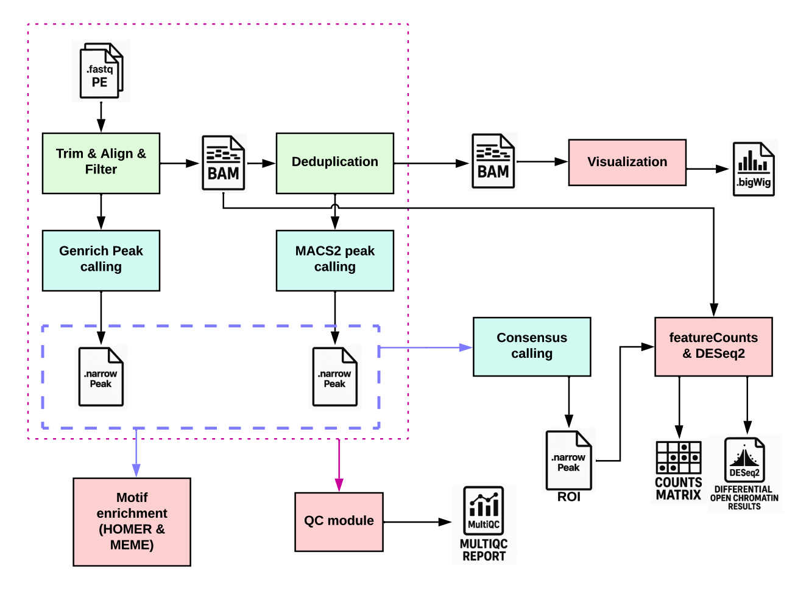
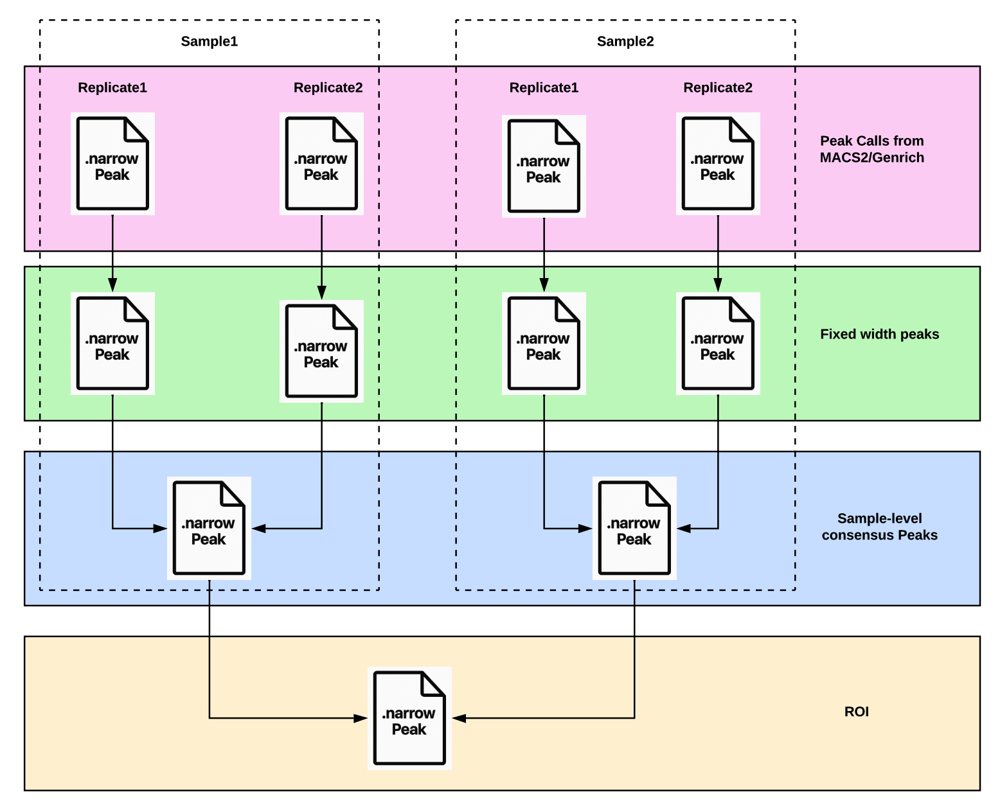

# 🌟 **Overview of ASPEN**

To address [these](introduction.md#challenges-in-atac-seq-data-analysis) challenges, CCBR developed ASPEN (**A**tac **S**eq **P**ip**E**li**N**e), an automated pipeline tailored for the comprehensive analysis of ATAC-seq data. ASPEN is designed to process paired-end Illumina sequencing data, guiding users from raw data through quality control, alignment, peak calling, and downstream analyses. By integrating a suite of established bioinformatics tools and adhering to best practices, ASPEN ensures robust, reproducible, and high-quality results. For more information on the challenges in ATAC-seq data analysis, refer to the [Challenges in ATAC-seq Data Analysis] section.

## **Flowchart**

The flowchart below provides a visual summary of the ASPEN pipeline, illustrating the key steps involved in preprocessing, alignment, peak calling, and downstream analyses.

## 🛠️ **Data Preprocessing**

### ✂️ **Adapter Trimming**

Utilizes CutAdapt to remove adapter sequences from raw reads, ensuring that subsequent analyses are not confounded by extraneous sequences.

### 📊 **Quality Assessment**

Employs FastQC for initial quality checks and MultiQC for aggregated reporting, providing comprehensive insights into data quality and highlighting potential issues such as low-quality bases or GC content biases.

## 🧬 **Alignment and Filtering**

### 🚫 **Blacklist Filtering**

Reads aligning to known blacklisted regions and mitochondrial DNA are systematically removed during the preprocessing stage. Blacklisted regions, as defined by ENCODE and other genomic consortia, represent genomic loci prone to artifacts due to their repetitive nature or unusually high signal, which can confound downstream analyses. Similarly, mitochondrial reads, which often constitute a significant proportion of sequencing data, are excluded to prevent skewing results and to ensure computational resources are focused on nuclear chromatin. This filtering step enhances the accuracy and reliability of peak detection by concentrating on biologically meaningful and interpretable regions of the genome.

### 🔗 **Read Alignment**

Reads are aligned to the reference genome using Bowtie2, a fast and memory-efficient aligner optimized for short-read sequencing data. This step produces several key output files essential for subsequent analyses:

- **`filtered.bam`**: A BAM file with low-quality alignments, reads mapping to blacklisted regions removed, ensuring high-quality data for differential open chromatin analysis.
- **`qsorted.bam`**: A quality-sorted BAM file containing all aligned reads, serving as the primary input for Genrich peak calling.
- **`dedup.bam`**: A BAM file with PCR duplicates removed, used for advanced downstream analyses such as transcription factor footprinting with TOBIAS.
- **`tagAlign.gz`**: A compressed file containing alignment information in a simplified format, specifically prepared for MACS2 peak calling.

This alignment process ensures that only high-confidence reads are retained, providing a robust foundation for accurate and reproducible ATAC-seq data analysis.

## 📈 **Peak Calling and Annotation**

### 🔍 **Peak Detection**

ASPEN employs both MACS2 and Genrich for the identification of regions of open chromatin, ensuring comprehensive detection of regulatory elements.

#### **MACS2 Peak Calling**

MACS2 is employed using the default parameters recommended by the ENCODE consortium, ensuring compliance with established best practices. ASPEN produces both unfiltered and q-value filtered peak calls, striking a balance between stringency and the flexibility to examine less stringent results.

#### **Genrich Peak Calling**

Genrich is integrated into the pipeline to complement MACS2. This tool is particularly well-suited for ATAC-seq data, as it accounts for the unique characteristics of transposase-accessible regions. By leveraging Genrich, ASPEN ensures that broader regulatory elements, such as enhancers and regions of open chromatin spanning multiple nucleosomes, are accurately identified.

By combining the strengths of MACS2 and Genrich, ASPEN delivers a comprehensive and reliable peak detection framework, facilitating downstream analyses and enabling researchers to uncover critical insights into chromatin accessibility and gene regulation.

### 🤝 **Consensus Peaks**

For datasets with multiple replicates, ASPEN employs several strategies to derive consensus peaks across replicates:

- **`consensus.bed`**: This file represents consensus peaks derived using the "Consensus MAX" strategy, as described by [_Yang et al._](https://doi.org/10.5936/csbj.201401002). It identifies overlapping peaks across replicates to define a shared set of regions.

- **`pooled.narrowPeak`**: In this approach, reads from all replicates are pooled together, and peak calling is performed on the combined dataset to generate a unified set of "pooled" peaks.

- **`fixed_width.consensus.narrowPeak`**: This method calculates consensus peaks by renormalizing p-value scores across replicates, following the approach outlined by [_Corces et al._](https://doi.org/10.1038/nmeth.4396).

Among these methods, the fixed-width consensus peak strategy is recommended for its robustness and reproducibility. The other outputs are provided primarily for exploratory purposes.

### 🏷️ **Peak Annotation**

ASPEN integrates ChIPseeker to perform comprehensive annotation of identified peaks, offering valuable insights into their genomic context and potential regulatory functions. This process involves associating peaks with specific genomic features, such as promoters, enhancers, gene bodies, or intergenic regions. By providing detailed annotations, ASPEN facilitates the interpretation of chromatin accessibility data, enabling researchers to uncover the functional significance of these regions in gene regulation and other biological processes.

### 🗺️ **Regions of Interest (ROI)**

Regions of Interest (ROIs) are generated through a systematic process to ensure consistency and reliability in downstream analyses:

- 🧩 **Replicate-Level Peaks**: `.narrowPeak` files from individual replicates are converted into fixed-width peaks, centering on their summits and extending ±250 bp to achieve a uniform width of 500 bp.
- 🧬 **Sample-Level Consensus Peaks**: Fixed-width replicate peak files are combined to generate a consensus set of peaks at the sample level, ensuring reproducibility across replicates.
- 🔗 **Merged ROIs**: Sample-level consensus peak files are merged using the [Coerses method](https://doi.org/10.1038/nmeth.4396) to create a comprehensive set of ROIs.

This approach ensures that ROIs represent biologically meaningful and reproducible regions, forming the foundation for robust downstream analyses.

## ✅ **Quality Control Metrics**

### 📏 **Fragment Length Distribution**

ASPEN employs custom scripts to analyze the distribution of fragment lengths within the sequencing data. This analysis provides critical insights into nucleosome positioning and overall sample quality. Characteristic patterns, such as the presence of nucleosome-free regions and distinct mono- or di-nucleosome peaks, serve as indicators of high-quality ATAC-seq data. These patterns reflect the accessibility of chromatin and the degree of nucleosome occupancy, which are essential for interpreting chromatin structure and regulatory dynamics.

### 📚 **Library Complexity**

To evaluate the sufficiency of sequencing depth and detect potential biases introduced during PCR amplification, ASPEN utilizes Preseq to estimate library complexity. This metric helps determine whether the sequencing effort is adequate to capture the diversity of the library, ensuring that the data is representative of the underlying chromatin landscape. By identifying potential saturation or over-representation of certain fragments, researchers can assess the reliability of their sequencing results.

### 🧬 **Transcription Start Site (TSS) Enrichment**

ASPEN calculates TSS enrichment scores, a widely recognized quality metric for ATAC-seq data. These scores measure the accumulation of sequencing reads around transcription start sites (TSS), which are hallmark regions of open chromatin. High TSS enrichment scores indicate well-prepared libraries with minimal technical artifacts, as they reflect the accessibility of promoter regions and the integrity of the chromatin preparation process.

### 📊 **Fraction of Reads in Peaks (FRiP)**

The Fraction of Reads in Peaks (FRiP) score quantifies the proportion of sequencing reads that fall within identified peaks, serving as a measure of the signal-to-noise ratio in the dataset. Higher FRiP scores indicate datasets with strong, biologically meaningful signals and minimal background noise. Additionally, ASPEN computes the fraction of reads localized to specific genomic features, such as promoters, enhancers, and DNase hypersensitive sites (DHS). These feature-specific FRiP scores provide further insights into the quality and biological relevance of the data.

---

## 🧬 **Motif Enrichment Analysis**

### 🔑 **HOMER and AME**

ASPEN integrates motif enrichment analysis tools, including HOMER and AME, to identify transcription factor binding motifs within accessible chromatin regions. This analysis provides valuable insights into the regulatory mechanisms governing gene expression. By uncovering enriched motifs, researchers can infer the potential transcription factors driving chromatin accessibility changes and identify key regulators of cellular processes. The combination of HOMER and AME ensures a comprehensive and robust approach to motif discovery, facilitating the interpretation of ATAC-seq data in the context of gene regulation and epigenetic control. HOCOMOCO v11 motifs, which are bundled as resources with ASPEN, are used for both motif enrichment tools.

## 📜 **Comprehensive Reporting**

### 📊 **MultiQC Integration**

Generates a comprehensive and interactive HTML report that consolidates all quality control metrics, analysis results, and visualizations into a single, user-friendly document. This report is designed to facilitate the interpretation of results, provide clear and actionable insights, and enable seamless sharing of findings with collaborators. By integrating diverse outputs into an organized and visually appealing format, the HTML report ensures that researchers can efficiently explore their data and communicate their discoveries effectively.

## 🔍 **Differential Accessibility Analyses**

ASPEN extends its core functionalities by offering advanced capabilities for differential chromatin accessibility analysis. This feature enables researchers to identify genomic regions exhibiting significant changes in chromatin accessibility under varying experimental conditions. The process encompasses several critical steps, including refining peak calls to fixed-width peaks, defining regions of interest (ROIs), quantifying Tn5 transposase insertion events, performing statistical analyses to detect differential signals, and integrating these findings with ChIP-seq annotations for comprehensive biological interpretation.

### 🛠️ **Refinement of Peak Calls to Fixed-Width Peaks**

Following the initial peak calling, ASPEN standardizes the identified peaks by centering them on their summits and extending them symmetrically to a uniform width of 500 base pairs (bp). This refinement ensures consistency across datasets and facilitates downstream analyses. The approach of extending peak summits by ±250 bp is a widely accepted practice in ATAC-seq data analysis, as it focuses on the most accessible regions of chromatin while minimizing variability in peak sizes. This standardization enhances the comparability of results across experimental conditions and replicates.

### 📍 **Definition of Regions of Interest (ROIs)**

ASPEN processes the fixed-width peak calls for each replicate across all samples to generate a comprehensive union of all identified peaks, referred to as Regions of Interest (ROIs). These ROIs serve as the foundation for subsequent quantification and statistical analyses. The pipeline outputs `ROI.bed` and `ROI.gtf` files for each peak caller, which are then utilized for quantifying counts using featureCounts. This systematic approach ensures a robust and consistent framework for differential accessibility analysis, enabling reliable interpretation of the results.

### 📊 **Quantification of Chromatin Accessibility**

Once the ROIs are established, ASPEN generates two key count matrices to quantify chromatin accessibility:

- **Tn5 Nicking Sites Count Matrix**: This matrix quantifies the frequency of Tn5 transposase insertion events at each ROI. The `filtered.bam` file is used to determine Tn5 insertion sites and count them. Tn5 transposase preferentially inserts into accessible chromatin regions, and the number of insertion events serves as a direct proxy for chromatin accessibility. This metric provides a precise measure of chromatin openness across experimental conditions.

- **Read Counts Matrix**: This matrix records the number of sequencing reads mapped to each ROI. Similar to the Tn5 nicking sites matrix, the `filtered.bam` file is used for this quantification. While Tn5 nicking sites offer a more direct measure of chromatin accessibility, read counts are included as they are widely utilized in recent publications. Together, these matrices provide a comprehensive view of chromatin accessibility dynamics.

### 📈 **Differential Accessibility Analysis Using DESeq2**

To identify statistically significant differences in chromatin accessibility between experimental conditions, ASPEN employs DESeq2, a widely recognized tool for differential analysis of count data. DESeq2 models the count data to detect changes in accessibility, offering robust statistical inferences even in complex experimental designs. By comparing the count matrices across conditions, DESeq2 identifies ROIs with significant differential accessibility, highlighting regulatory elements that may play critical roles in the biological context of the study.

This comprehensive approach to differential accessibility analysis enables researchers to uncover key insights into chromatin dynamics, regulatory mechanisms, and gene expression changes, providing a deeper understanding of the underlying molecular processes.

#### 🧬 **Integration with Gene Annotations**

To enhance the biological interpretation of differential accessibility results, ASPEN integrates the findings with peak and gene annotations from ChIPSeeker, offering insights into the regulatory landscape of the genome. This integration allows researchers to identify genes located near differentially accessible peaks, which can be crucial for understanding the functional implications of chromatin accessibility changes. By associating these peaks with nearby genes, scientists can infer potential regulatory relationships and gain a deeper understanding of the underlying molecular mechanisms.

#### 🧪 **Optional: Spike-In Normalization**

To account for potential global shifts in chromatin accessibility—particularly in perturbation studies where widespread chromatin compaction or relaxation may occur—ASPEN optionally supports **spike-in normalization**.

Spike-in normalization involves the use of exogenous DNA or cells from a different species (e.g., _Drosophila melanogaster_ or _E. coli_) that are added in equal proportions across all experimental samples prior to lysis and tagmentation. These spike-in reads serve as an internal control to correct for technical variation and global accessibility shifts that may not be captured by traditional normalization strategies.

In ASPEN, if spike-in data is present:

- Reads are aligned to both the host and spike-in genomes using dual alignment indices.
- The number of spike-in reads is counted for each sample.
- A normalization factor is calculated based on spike-in counts and applied to the accessibility read counts from the host genome.

This spike-in-derived scaling factor allows the comparison of chromatin accessibility across conditions even when global chromatin accessibility levels differ (e.g., treatment-induced repression or global decondensation). This method is particularly valuable in experiments involving:

- Transcription factor knockdowns/knockouts
- Chromatin remodeler inhibition
- Drug-induced chromatin modulation

ASPEN performs spike-in-aware normalization transparently, and reports both raw and normalized counts in the final output matrix for differential analysis. This ensures flexibility in downstream interpretation while preserving the ability to adjust for systemic experimental artifacts.

### 📊 **Reporting**

ASPEN enhances differential chromatin accessibility analysis by providing an interactive HTML report generated from DESeq2 results, featuring various visualizations. Additionally, it offers a TSV (tabl-delimited) file with integrated gene annotations, compatible with Microsoft Excel, enabling efficient data manipulation and facilitating the identification of genes near regions with altered accessibility. The Excel file is aggregated accross all different contrasts queried in the project.
